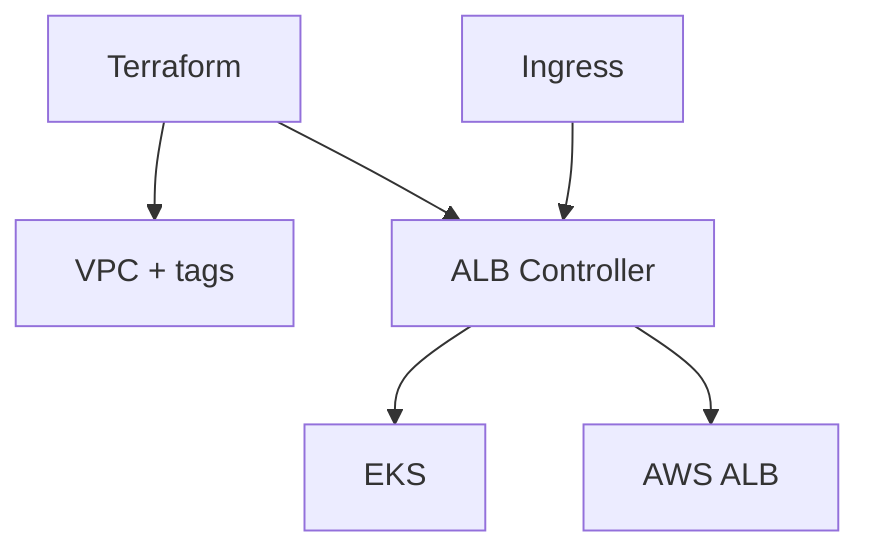

# Presentación — VPC + AWS Load Balancer Controller (EKS)

Material listo para publicar en **LinkedIn** (post + carrusel). Copiá cada sección como una diapositiva o bloque del post.

**Speech listo para copiar/pegar:** [speech-linkedin.md](speech-linkedin.md)

---

## Slide 1 — Hook

### La base que falta antes de publicar Ingress en EKS

Presento **VPC + AWS Load Balancer Controller (EKS)**: VPC etiquetada para EKS y AWS Load Balancer Controller — base de ingress en AWS

Terraform · VPC · EKS · AWS Load Balancer Controller · IRSA

---

## Slide 2 — El dolor

- Subnets sin tags → ALB no aparece
- Controller sin IRSA → permisos rotos
- Cada cluster se configura distinto

**Automatizar esto no es lujo — es repetibilidad.**

---

## Slide 3 — Qué hace

---

## Slide 4 — Características

- **VPC**: Tags listos para EKS / ALB discovery
- **ALB Controller**: Helm/Terraform sobre el cluster
- **IRSA**: Roles IAM vía OIDC del cluster
- **Ejemplo**: Carpeta `example/` de referencia
- **Modular**: `vpc/` + `alb-controller/`

---

## Slide 5 — Cómo probarlo

1. Cloná el repo
2. Copiá `terraform.tfvars.example` → `terraform.tfvars`
3. `terraform init && plan && apply`
4. Revisá outputs / recursos en la consola AWS

Repo: `https://github.com/ghcetraro/terraform_aws_eks_alb_controller`

---

## Slide 6 — CTA

Open source · MIT · listo para adaptar a tu cuenta.

⭐ Si te sirve, estrella en GitHub y compartí feedback.

`https://github.com/ghcetraro/terraform_aws_eks_alb_controller`
